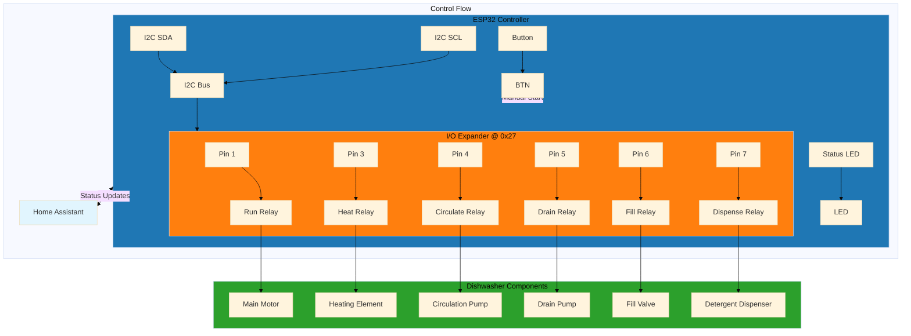

# Hardware Wiring Guide

## Overview

This dishwasher controller uses an ESP32 with a PCF8574 I/O expander to control 6 relays that manage the dishwasher functions.

## Hardware Wiring Diagram


                                               |   | P0        |
                                               |   +-----------+
                                               |   | P1        |---→ Run Dishwasher Relay
                                               |   +-----------+
                                               |   | P2        |---→ (Unused)
                                               |   +-----------+
                                               |   | P3        |---→ Heat Relay
                                               |   +-----------+
                                               |   | P4        |---→ Circulation Relay
                                               |   +-----------+
                                               |   | P5        |---→ Drain Relay
                                               |   +-----------+
                                               |   | P6        |---→ Fill Relay
                                               |   +-----------+
                                               |   | P7        |---→ Dispense Relay
                                               |   +-----------+

ESP32 GPIO Connections
+------------------+
| GPIO0           |---→ Push Button (to GND)
| GPIO23           |---→ Status LED (+ Resistor + LED)
| GND             |---→ Common Ground
| 5V              |---→ Relay Power (if 5V relays)
| 3V3             |---→ PCF8574 Power
+------------------+
```

## Detailed Connections

### ESP32 to PCF8574 (I2C Bus)
| ESP32 | PCF8574 | Wire Color | Purpose |
|-------|-----------|------------|---------|
| GPIO2  | SDA       | Blue       | I2C Data |
| GPIO15 | SCL       | Green      | I2C Clock |
| 3V3    | VCC       | Red        | Power     |
| GND    | GND       | Black      | Ground    |

### PCF8574 to Relays
| PCF8574 | Relay      | Dishwasher Function |
|----------|------------|-------------------|
| P1       | K1         | Run Dishwasher    |
| P3       | K3         | Heat Element     |
| P4       | K4         | Circulation Pump  |
| P5       | K5         | Drain Pump       |
| P6       | K6         | Fill Valve       |
| P7       | K7         | Detergent Disp.  |

### ESP32 Additional Connections
| ESP32 | Component | Connection Details |
|-------|------------|-------------------|
| GPIO0  | Push Button | Momentary switch to GND (built-in pullup) |
| GPIO23  | Status LED  | LED + 220Ω resistor to GND |

## Power Requirements

### ESP32 Power
- **Voltage**: 3.3V (from onboard regulator)
- **Current**: ~50mA typical

### PCF8574 Power
- **Voltage**: 3.3V or 5V
- **Current**: ~1mA quiescent + load current

### Relay Considerations
- **Coil Voltage**: Match to your relay (5V, 12V, or 24V)
- **Coil Current**: 70-120mA typical per relay
- **Contact Rating**: Match to dishwasher requirements (120V/240V AC)
- **Driver Circuit**: Use transistor/MOSFET for ESP32 protection

## Safety Notes

⚠️ **CRITICAL**: Isolate low-voltage control circuits from high-voltage AC circuits!

- Use proper relay modules with opto-isolation
- Include flyback diodes for inductive loads
- Fuse AC circuits appropriately
- Follow local electrical codes
- Consider adding emergency stop button

## PCB Design Suggestions

For a more permanent installation, consider designing a PCB:

1. **Mount ESP32 and PCF8574**
2. **Include relay driver circuits** (ULN2003 or similar)
3. **Add screw terminals** for dishwasher connections
4. **Include LED indicators** for each relay
5. **Add power regulation** (5V for relays, 3.3V for logic)
6. **Include fuse holder** for AC protection

## Testing Procedure

1. **Continuity Test**: Verify all connections with multimeter
2. **Power Test**: Apply only low-voltage power first
3. **Function Test**: Test each relay with load lamp
4. **Integration Test**: Connect to actual dishwasher
5. **Safety Test**: Verify all safety interlocks work

Remember: Test with a **load lamp** before connecting to actual dishwasher components!